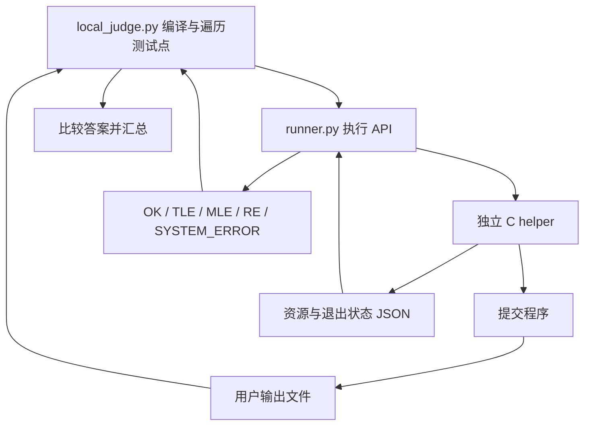

# 01 · 先跑通一次 A+B

[目录](README.md) · [下一章：程序变成进程](02-process.md)

一份 A+B 程序只知道“读取两个数，输出它们的和”。它不知道题号、时限，也不知道正确答案。评测机负责准备这些外部条件，然后检查运行结果。先把这两种职责分开，后面就不容易把执行器当成完整判题机。

## 第一步：直接运行提交

实验文件 [sum.cpp](examples/sum.cpp) 是一份普通的竞赛程序：

```cpp
#include <iostream>

int main() {
    long long a, b;
    if (!(std::cin >> a >> b)) return 1;
    std::cout << a + b << '\n';
}
```

它读不到两个数时返回 1，正常结束时返回 0。此处的 `return` 只报告程序是否正常完成，不报告答案是否正确。

在仓库根目录构建并运行：

```bash
make
make -C docs/tutorial/examples
printf '2 3\n' | docs/tutorial/examples/.build/sum
```

预期输出 `5`。这里的 `|` 由 shell 把左边程序的输出接到右边程序的输入。提交仍然在调用 `cin`，并不需要知道输入来自键盘还是另一个程序。

## 第二步：把同一份源文件交给评测机

```bash
python3 local_judge.py --pid 1000 docs/tutorial/examples/sum.cpp \
  --testdata testData --checker none --no-cgroup
```

这条命令应显示编译通过，最后显示：

```text
结果：AC  通过 10/10  用时 ...s
```

具体耗时会变化。`--testdata testData` 固定使用仓库自带的数据，避免当前目录之外的题库影响实验。`--checker none` 固定使用内置比较器。`--no-cgroup` 让第一章暂时只关心执行和答案；输出里会明确提示不能判 MLE。

这次评测与直接运行相比，多出了这些步骤：

1. 找到 `testData/1000/config.json` 和 `data/` 中的输入输出对。
2. 编译源文件，把可执行文件放到临时工作目录。
3. 对每个输入文件启动一次提交，保存它的输出。
4. 收集运行资源与退出状态，再比较实际输出和标准输出。
5. 汇总所有测试点，并清理临时文件。

编译发生一次，每个测试点的运行则各发生一次。提交里的全局变量不会自动跨测试点保留。

## 第三步：分别观察资源结果与答案结果

```bash
printf '2 3\n' > docs/tutorial/examples/.build/input
python3 runner.py --no-cgroup \
  --input docs/tutorial/examples/.build/input \
  --output docs/tutorial/examples/.build/output \
  -- docs/tutorial/examples/.build/sum
cat docs/tutorial/examples/.build/output
```

`runner.py` 输出一份 JSON，正常情况下 `verdict` 是 `OK`。后面的 `cat` 才显示用户输出 `5`。

`--` 表示执行器参数到此结束，后面的内容属于待运行程序。与上一步不同，`runner.py` 接受的是**已经编译好的程序**，不接受 `.cpp` 源文件。

`OK` 的含义是：没有观察到资源超限或异常退出。它不等于 AC，因为执行器没有收到标准答案。只有 `local_judge.py` 比较输出以后，才能给出 AC 或 WA。

## 现在建立一张地图



这是一张职责图，不是进程数量图。`local_judge.py` 导入 `runner.py` 后，它们通常在同一个 Python 进程里运行；helper 和提交才是另外创建的进程。

## 回到源码

打开 [local_judge.py](../../local_judge.py)，找到 `main()`。本章只认出四个路标：`load_cases()`、`compile_submission()`、循环中的 `run_case()`、`compare_output()`。

随后打开 [runner.py](../../runner.py)，看 `__all__` 和 `CaseResult`。`__all__` 列出打算公开提供的名字；`CaseResult` 把一次运行的资源、退出原因、消息和输出路径装在一起。暂时无需理解每个字段的来源。

## 停下来想一想

如果把 `a + b` 改成 `a - b`，程序仍正常返回 0，应该由谁发现错误？

<details>
<summary>参考答案</summary>

helper 看到正常退出，`runner.py` 通常给出 OK；`local_judge.py` 比较输出时才发现答案不同，给出 WA。资源执行和答案检查必须分开，否则执行器会被迫理解每一道题。

</details>

如果没有得到预期结果，先检查：实验是否已编译、命令是否在仓库根目录执行、是否显式选择了自带 `testData`。本章出现 `0.0MiB` 是没有 cgroup 内存测量的展示值，不代表进程没有使用内存。
