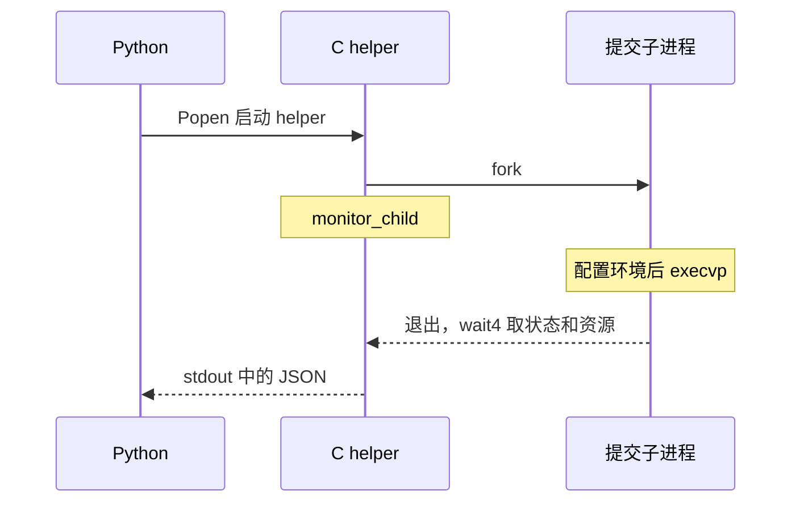

# 03 · 创建一个进程，替换它，再收回结果

[上一章](02-process.md) · [目录](README.md) · [下一章：文件描述符](04-file-descriptors.md)

如果评测机直接把自己替换成提交，它就没有机会检查超时、收集资源、继续下一测试点。因此需要留下一位监控者，同时另开一个进程运行提交。

## 第一步：同一个位置为什么会返回两次

运行 [fork_exec.cpp](examples/fork_exec.cpp)：

```bash
docs/tutorial/examples/.build/fork_exec
```

预期结构如下，PID 每次不同：

```text
before exec: pid=12341 value=99
after exec: pid=12341
parent value=7
exit=7
```

先看第一半代码：

```cpp
int value = 7;
pid_t child = fork();
if (child < 0) { /* 创建失败 */ }
if (child == 0) { /* 子进程分支 */ }
```

`fork()` 成功后出现父、子两个进程。它们都从调用之后继续执行：父进程得到子进程 PID，子进程得到 0。这个返回值分流了控制路径。

子进程把 `value` 改成 99，父进程读到的仍是 7。它们拥有独立的地址空间；Linux 通常通过写时复制延迟复制物理内存页，但这不改变变量相互独立的效果。不要把子进程当成共享同一组普通变量的另一个线程。参见 [fork 的定义](https://man7.org/linux/man-pages/man2/fork.2.html)。

## 第二步：exec 不会再创建一个 PID

子进程接着执行：

```cpp
execl("/bin/sh", "sh", "-c",
      "printf 'after exec: pid=%s\n' \"$$\"; exit 7",
      static_cast<char *>(nullptr));
```

本实验特意运行一个 shell，让它打印自己的 PID（`$$`），再退出 7。观察前后 PID 相同：`exec` 替换的是当前进程正在运行的程序，其身份仍延续。

| 参数 | 本实验中的意义 |
|---|---|
| `/bin/sh` | 要装入的可执行文件 |
| `sh` | 新程序收到的 `argv[0]` |
| `-c` 与后续字符串 | 这个 shell 自己理解的参数 |
| 空指针 | 标记可变参数列表结束 |

exec 成功后，原来的代码没有“下一行”。只有失败时它才返回。因此紧跟其后的 `perror("exec")` 和 `_exit(127)` 是错误路径。[execve 手册](https://man7.org/linux/man-pages/man2/execve.2.html) 详细说明了替换后保留和重置的进程属性。

实验在 exec 前显式 `fflush(stdout)`，因为尚未写到文件描述符的 C 库缓冲数据会随旧程序一起消失。`_exit()` 则直接终止进程，不运行继承的退出回调，也不冲刷那些用户态缓冲。项目在子进程准备失败时用它，避免把父进程继承来的缓冲重复写一遍。

## 第三步：父进程等待并回收

父进程执行：

```cpp
waitpid(child, &status, 0);
```

`child` 指定要等待哪个子进程，`&status` 接收退出状态，最后的 0 表示等待相关状态出现。实验循环处理 `EINTR`：等待可能被信号打断，这时应重试。

子进程退出后，内核会短暂保留其退出信息，等父进程取走。这个动作叫回收；没有回收的已退出进程可能呈现为僵尸。它已不执行用户代码，但留下了进程表记录。第 6 章会把 `waitpid` 换成还能收资源统计的 `wait4`。

`status` 并非单纯的 `return` 数值。先用 `WIFEXITED(status)` 判断是否正常退出，再用 `WEXITSTATUS(status)` 取退出码；下一章之后会完整解释异常退出。

## 回到源码：三种角色怎样形成



在 [runner_helper.c](../../runner_helper.c) 中，从 `main()` 的 `fork()` 开始读：`child == 0` 进入 `run_child()`，父进程走到 `monitor_child()`。再找 `execvp(options->command[0], options->command)`。

`execvp` 的 `v` 对应参数数组，`p` 表示没有路径分隔符时按 PATH 查找。与实验显式启动 shell 不同，项目把用户命令作为参数数组直接传递，不替用户解释 `$(...)`、`>` 等 shell 语法。

项目先把 Python 的子进程 exec 成较小的 helper，再由 helper fork 提交。这给提交的辅助 RSS 统计提供了较小的起点，也把准备和监控放到独立的单线程 C 程序中。cgroup 内存判定本身并不依赖这项 RSS 修正。

### C++ 学生读 C 文件时的一处语法差异

`parse_options()` 中的 `(struct Options){ .cpu_seconds = ..., ... }` 是 C 的复合字面量和指定字段初始化。可以理解为“构造一个 Options，并按字段名填值”。项目 Makefile 用 C11 编译 helper；不要因为实验使用 C++17，就把 helper 直接改成由 `g++ -std=c++17` 编译。Linux 接口可以共用，源文件使用的语言语法仍要区分。

## 停下来想一想

如果把 `monitor_child()` 放进 `child == 0` 分支，并在其前面执行成功的 `execvp()`，监控循环会运行吗？

<details>
<summary>参考答案</summary>

不会。exec 成功后旧程序已经被替换，原分支后面的代码不再执行。监控必须留在父进程；它拥有子进程 PID，也能够等待并回收这个子进程。

</details>
