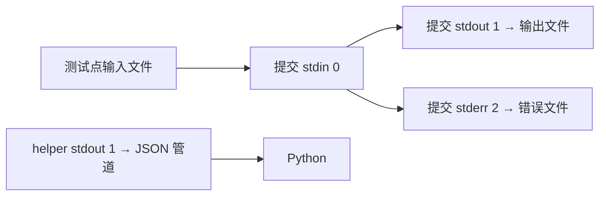

# 04 · 让 cin 读输入文件，让 cout 写答案文件

[上一章](03-fork-exec-wait.md) · [目录](README.md) · [下一章：退出状态与错误管道](05-status-and-pipe.md)

提交只会调用 `cin`、`cout`。评测机需要在不改提交源码的情况下，把它们连接到本测试点的文件。连接发生在子进程 exec 之前。

## 第一步：把标准流理解为三个编号

进程通过文件描述符访问已打开的文件或管道。文件描述符是一个非负整数，在本进程的描述符表中查找对应的打开对象。

| 编号 | 名称 | 普通终端里常见的连接 |
|---|---|---|
| 0 | stdin，标准输入 | 键盘输入 |
| 1 | stdout，标准输出 | 终端输出 |
| 2 | stderr，标准错误 | 终端上的诊断输出 |

`cin`、`cout` 是语言库提供的接口，底层通常连接到 0、1。编号本身不保证后面是终端。评测器可以使 0 指向 `1.in`，使 1 指向 `1.user.out`。

## 第二步：观察一次重定向

```bash
printf '2 3\n' > docs/tutorial/examples/.build/input
docs/tutorial/examples/.build/redirect \
  docs/tutorial/examples/.build/sum \
  docs/tutorial/examples/.build/input \
  docs/tutorial/examples/.build/output
cat docs/tutorial/examples/.build/output
```

第一条运行结果在终端显示：

```text
parent stdout still points to the terminal
```

而输出文件里是 `5`。父进程的提示没有混到答案中。

打开 [redirect.cpp](examples/redirect.cpp)，先读 `redirect()`：

```cpp
int fd = open(path, flags, 0600);
dup2(fd, target);
if (fd != target) close(fd);
```

假设 `open` 返回 3，`target` 是 1。`dup2(3, 1)` 让 1 也指向同一个打开对象，并替换原来 1 的连接。随后关闭多余的 3，1 仍可使用；这没有复制文件内容。[dup2 手册](https://man7.org/linux/man-pages/man2/dup.2.html) 给出了具体语义。

`if (fd != target)` 很重要：如果 `open` 本来就分配到 1，`dup2(1, 1)` 不改变它，接着无条件 `close(1)` 却会关闭我们刚准备好的 stdout。

## 第三步：理解打开文件的选项

输入使用 `O_RDONLY`，因为提交只需要读取测试点。输出使用三个按位组合的标志：

| 标志 | 含义 | 本次评测的目的 |
|---|---|---|
| `O_WRONLY` | 只写 | 接收提交输出 |
| `O_CREAT` | 不存在就创建 | 首次执行也能得到输出文件 |
| `O_TRUNC` | 已存在则清空 | 不保留上一次运行的尾部内容 |
| `0600` | 新文件的初始权限，八进制 | 只给文件所有者读写权限，还会受 umask 影响 |

最后这个数字是创建权限，不是打开方式。前导 0 在 C/C++ 中表示八进制。
`umask` 是进程创建文件时使用的权限屏蔽值，会从请求的权限中去掉一些权限。这里要求 0600，意思是没有主动授予其他用户读写新输出文件的权限。

为什么一定在子进程中重定向？fork 后父子各有描述符表，修改子进程的 1 不会把父进程的 1 也改掉。打开对象本身可以共享，但“某个编号连接到哪里”属于各自的表。

## 回到源码：存在三条不同的信息路径

阅读 [runner_helper.c](../../runner_helper.c) 的 `redirect_stream()`，可以看到与实验相同的结构，只是失败时通过 `setup_failed()` 报错。

在项目里，连接关系如下：



helper 的 1 与提交的 1 属于不同进程，因此能指向不同目的地。用户即使打印一大段 JSON，也只会写到答案文件，不会覆盖 helper 的资源报告。

再看 [runner.py](../../runner.py) 的 `_check_stream_paths()`。因为 `O_TRUNC` 会清空文件，所以 stdin、stdout、stderr 不能指向同一个文件。只比较路径字符串还不够：符号链接和硬链接可能把不同名字指向同一个实际文件。这里同时检查解析后的路径和 `samefile()`。

## 用测试验证

```bash
python3 -m unittest -v \
  test_runner.NoCgroupRunnerTests.test_redirects_and_arguments \
  test_runner.NoCgroupRunnerTests.test_invalid_limits_and_stream_aliases
```

第一项证明输入输出与参数原样传递，第二项证明文件别名会在执行前被拒绝。

## 停下来想一想

如果把输出文件误设成输入文件，却没有提前检查，会在什么时刻破坏输入？

<details>
<summary>参考答案</summary>

子进程用 `O_TRUNC` 打开输出文件时就会清空它，甚至还没 exec 提交程序。到提交开始读取时，测试数据已经被评测器自己破坏了。

</details>
