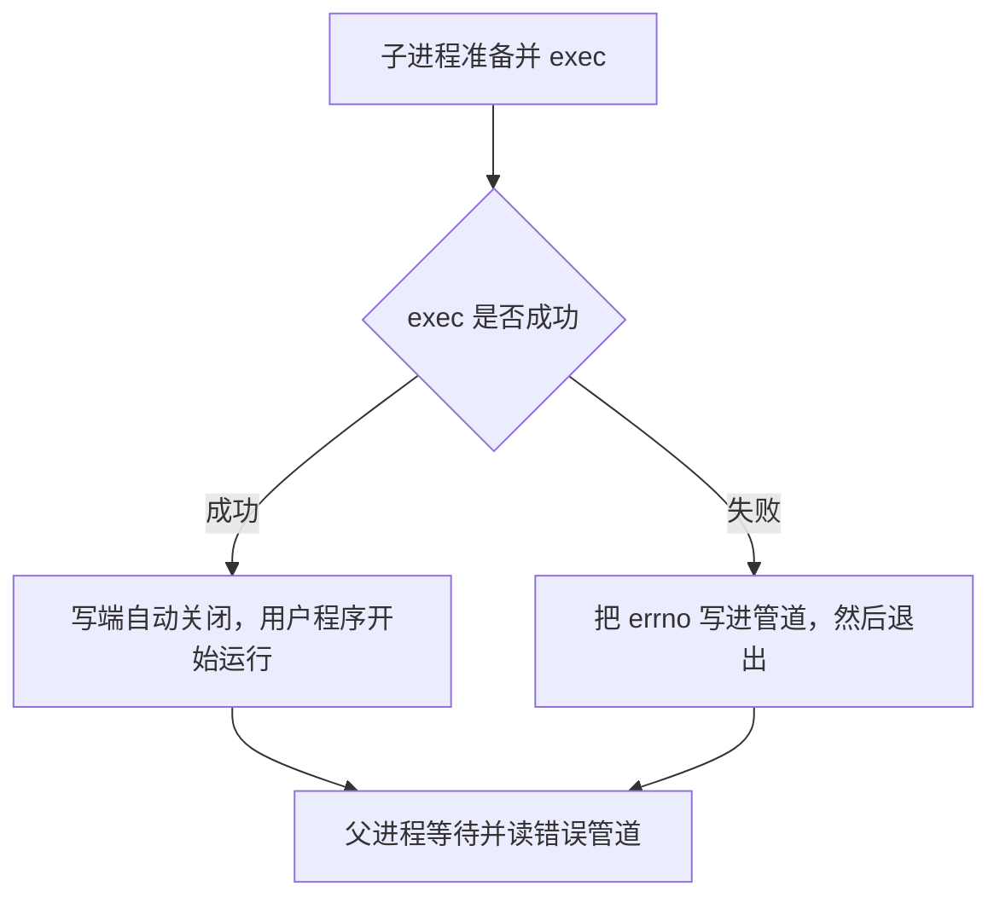

# 05 · 退出 127：选手程序出错，还是根本没启动？

[上一章](04-file-descriptors.md) · [目录](README.md) · [下一章：时间和限额](06-time-and-limits.md)

前面的简化启动器在 exec 失败后 `_exit(127)`。但用户程序也可以自己 `return 127`。单看退出码，无法区分这两种情况。项目为“准备阶段失败”额外保留了一条消息通道。

## 第一步：运行两个看起来相同的退出

```bash
docs/tutorial/examples/.build/error_pipe /bin/sh -c 'exit 127'
docs/tutorial/examples/.build/error_pipe /this-path-does-not-exist/solution
```

第一条应打印：

```text
no setup error record
exit=127
```

第二条应打印类似：

```text
setup errno=2
exit=127
```

两次退出码相同，额外的错误记录不同。Linux 中常见的 errno 2 是文件不存在。实验只展示证据；在项目里，第一类是 RE，第二类是 SYSTEM_ERROR。

## 第二步：认识管道的两端

[error_pipe.cpp](examples/error_pipe.cpp) 在 fork 前创建：

```cpp
int channel[2];
pipe2(channel, O_CLOEXEC);
```

`channel[0]` 是读端，`channel[1]` 是写端。fork 后父子都继承了两个编号。我们只需要子写父读，于是子进程关闭读端，父进程关闭写端。

这不是形式上的整理。当没有数据但仍有写端打开时，阻塞式 `read()` 可能等待新数据；等所有写端关闭且已有数据读完，`read()` 返回 0，也就是 EOF。父进程若忘记关闭自己的写端，就可能一直等不到 EOF。[管道手册](https://man7.org/linux/man-pages/man7/pipe.7.html) 解释了这个条件。

## 第三步：用 exec 自动关闭写端

`O_CLOEXEC` 表示成功 exec 时自动关闭这些描述符。这样形成两条路径：



注意表达要准确：**有错误记录证明准备失败；没有记录不单独证明用户程序已经成功运行。** 子进程也可能在 exec 前被超时监控杀掉，管道同样变成 EOF。还必须结合退出信号、`timed_out` 等证据。

项目中的记录是 `SetupError`，包含 `operation[32]` 和 `number`。因此能够报告 `redirect stdin: ...`、`exec: ...`，而不只是一个数字。记录来自本项目的父子进程，不是要跨机器交换的通用网络协议。

## 第四步：正确解释 wait 的 status

`wait4` 或 `waitpid` 填入的 `status` 编码了不同退出方式。把它直接当成退出码会出错。

| 先检查 | 再读取 | 说明 |
|---|---|---|
| `WIFEXITED(status)` | `WEXITSTATUS(status)` | 程序正常走到退出，退出码可能非零 |
| `WIFSIGNALED(status)` | `WTERMSIG(status)` | 程序被信号终止 |

“正常退出”是退出机制上的分类，`exit(127)` 也属于这个分支；在评测结果中，它仍是 RE。

## 回到源码

按以下顺序阅读 [runner_helper.c](../../runner_helper.c)：

1. `main()` 创建私有错误管道，并关闭不需要的端点。
2. `setup_failed()` 保存 errno、写固定大小的记录、`_exit(126)`。
3. 父进程先 `monitor_child()`，后 `check_setup()`。先监控避免在子进程准备卡住时只顾着阻塞读管道。
4. 确认没有准备错误后，`print_result()` 输出 CPU 时间、wall 时间、RSS、退出码和信号。

helper 自己的退出码与用户程序的退出码是两件事。用户退出 127，可以得到“helper 正常退出、JSON 中 `exit_code=127`”；准备失败时 helper 退出 125，Python 将其转换为 SYSTEM_ERROR。

再读 [runner.py](../../runner.py) 的 `_invoke_helper()`：`communicate()` 收取 helper 的 stdout/stderr，检查 helper 退出码，然后用 `json.loads()` 解析报告。它没有把用户 stderr 作为判题依据。

## 用测试验证

```bash
python3 -m unittest -v \
  test_runner.NoCgroupRunnerTests.test_failed_exec_is_setup_error \
  test_runner.NoCgroupRunnerTests.test_user_exit_codes_and_stderr_are_not_setup_or_mle
```

第二项让提交打印 `MemoryError` 再退出。结果仍是 RE，因为文本是用户可控输出，不是发生 OOM 的证据。

## 停下来想一想

为什么不用用户的 stderr 传准备错误？

<details>
<summary>参考答案</summary>

用户程序可以写任意 stderr，也可能模仿工具的错误消息。私有管道只在准备阶段开放，exec 时关闭；项目据此区分工具失败与用户输出，不需要猜测字符串内容。

</details>
