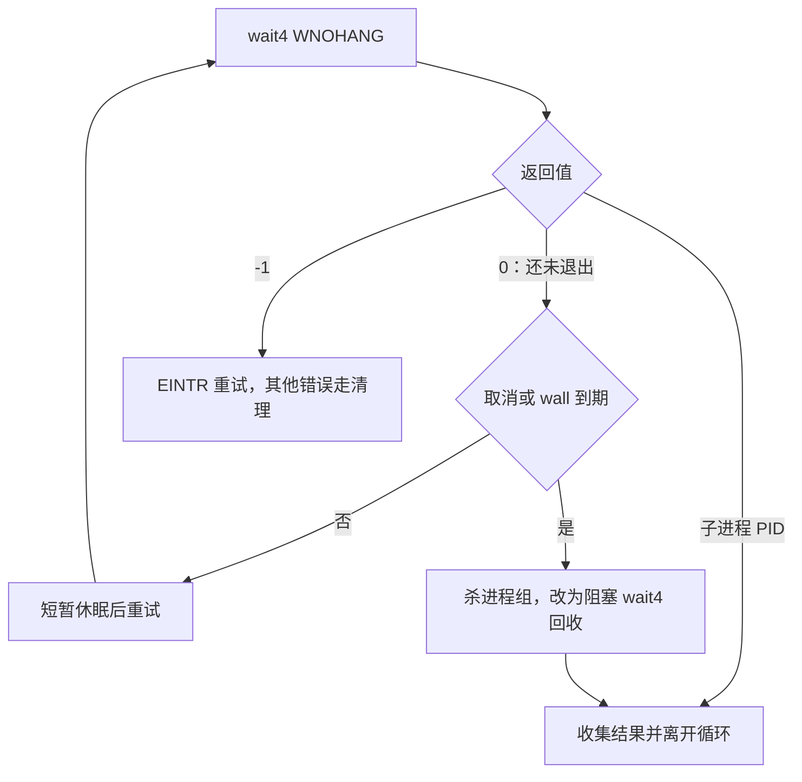

# 06 · 时间不只有一种，限制也不只有一道线

[上一章](05-status-and-pipe.md) · [目录](README.md) · [下一章：信号与清理](07-signals-and-cleanup.md)

让提交运行起来以后，第一个问题是：它一直不退出怎么办？“运行了一秒”可能意味着一直在计算，也可能意味着一直在睡眠。评测器需要分别处理。

## 第一步：测量睡眠和忙循环

```bash
docs/tutorial/examples/.build/usage sleep
docs/tutorial/examples/.build/usage cpu
```

[usage.cpp](examples/usage.cpp) 中，父进程测量从 fork 到回收之间的时间；子进程设置 CPU 软限制 1 秒、硬限制 2 秒，然后睡眠或一直计算。

预期观察：

| 模式 | CPU 时间 | wall 时间 | 退出方式 |
|---|---|---|---|
| `sleep` | 通常很小 | 约 1000ms | `exit=0` |
| `cpu` | 接近 CPU 软限制 | 通常约一秒，机器忙时更长 | 被 SIGXCPU 终止 |

CPU 时间是进程真正占用 CPU 的累计时间，包括用户态时间 `ru_utime` 和内核为它工作的时间 `ru_stime`。wall 时间是观察者经历的时间，包含调度、等待和 I/O。实验用单调时钟测 wall，避免日历时间调整改变截止时间判断。

父进程通过 `wait4(child, &status, 0, &usage)` 同时取退出状态和资源统计。[wait4 手册](https://man7.org/linux/man-pages/man2/wait4.2.html) 说明了最后一个参数提供的资源数据。

## 第二步：让内核限制子进程

```cpp
rlimit cpu{1, 2};
setrlimit(RLIMIT_CPU, &cpu);
```

两个值分别是 soft 和 hard。CPU 达到 soft 时内核发送 SIGXCPU；继续消耗到 hard 时会被 SIGKILL 终止。实验保持信号默认行为，所以通常在 soft 就结束。

限制设置在子进程里，并随 exec 继续生效。它不会把父进程也限制成一秒。CPU 限额的单位是整数秒，不能直接把 `1000` 当毫秒传进去。[资源限额手册](https://man7.org/linux/man-pages/man2/getrlimit.2.html) 列出了各资源不同的单位和作用范围。

## 第三步：计算项目真正使用的两道线

打开 [runner.py](../../runner.py) 的 `Limits`。默认题目 CPU 时限是 1000ms，保护余量是 200ms。传给内核的 soft 值按下面计算：

```text
ceil((1000 + 200) / 1000) = 2 秒
hard = soft + 1 = 3 秒
```

这并不表示题目允许跑两秒。题目阈值仍是 1000ms。一个正常结束、实际消耗 1100ms CPU 的程序，在最终判定时仍是 TLE；保护余量让它有机会完成，而不用一过题目阈值就被杀掉。

Python 的 `(x + 999) // 1000` 是正整数向上取整除法。`//` 表示整除，不是 C++ 风格注释。`helper_args()` 统一把毫秒、MiB 等单位转成 C helper 需要的秒和字节。

另一个独立保护是 wall：默认 `time_ms + wall_slack_ms = 1500ms`。哪怕程序只是睡眠、不怎么耗 CPU，超过 wall 也应结束。`time_ms=0` 时默认同时关闭自动 wall 限制；显式指定的正 wall 时限仍有效。

## 第四步：读懂监控循环

进入 [runner_helper.c](../../runner_helper.c) 的 `monitor_child()`。先只跟踪以下控制流：



`WNOHANG` 的作用是“没有结果就立即返回”。没有它，父进程可能一直卡在等待中，无法检查 wall 截止时间。每次轮询后睡约 1ms，避免监控者自己占满 CPU。

wall 不是精确到某一微秒的实时中断：轮询、调度和回收都有延迟。CPU 统计和 cgroup 峰值也不是靠这个 1ms 循环采样出来的，不能把三件事混在一起。

起点在 fork 之前，因此提交卡在 exec 前的准备阶段也受监控。测试中的 FIFO 是一种能让打开输入阻塞的特殊文件，专门验证这一点。

## 第五步：认出其他资源限额

再读 `apply_limit()` 及其调用点。CPU 之外还有：

| 资源 | 作用 | 阅读时注意 |
|---|---|---|
| `RLIMIT_STACK` | 栈大小 | 递归过深可能触发；不是所有内存之和 |
| `RLIMIT_FSIZE` | 单个输出文件可增长到的大小 | stdout/stderr 文件各受约束，不是二者总额 |
| `RLIMIT_NPROC` | 同一真实 UID 的进程/线程数 | 默认关闭，不是某份提交独享的进程配额；特权身份有例外 |
| `RLIMIT_CORE` | core dump 文件大小 | 固定为 0，避免异常提交留下大型转储 |

除 CORE 外，配置 0 表示不主动设置这项限额；它不会撤销从外部继承的限制。当前实现没有用 `RLIMIT_AS` 判 MLE，内存管理要等第 8 章。

CPU 也不是完整进程树的统一预算：各进程的 `RLIMIT_CPU` 不构成全树总额，`wait4` 的 rusage 虽可能包含子进程已经回收的后代用量，也不能保证覆盖任意后代。不要把这里理解成 cgroup CPU 配额。

## 验证与思考

```bash
python3 -m unittest -v \
  test_runner.NoCgroupRunnerTests.test_cpu_margin_allows_finish_before_judging \
  test_runner.NoCgroupRunnerTests.test_wall_timeout \
  test_runner.NoCgroupRunnerTests.test_wall_timeout_covers_setup_before_exec
```

为什么比较 CPU 阈值时用 `cpu_time_us`，而不使用展示的整数 `cpu_time_ms`？

<details>
<summary>参考答案</summary>

1000001 微秒已经超过 1000ms，但展示时可能仍四舍五入成 1000ms。判定用原始精度，展示才取整，才能避免边界被意外放宽。

</details>
