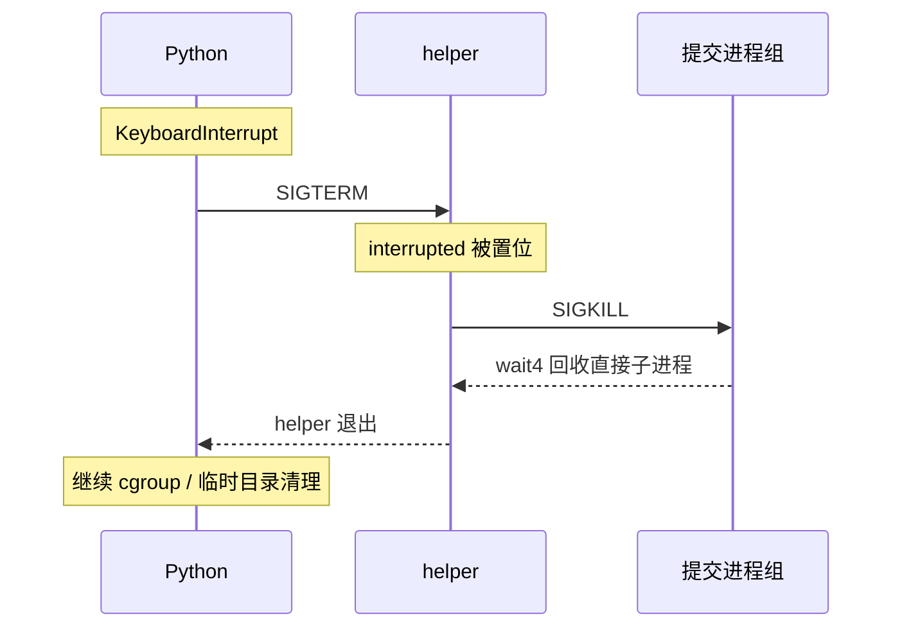

# 07 · 超时后，怎样把这次运行收拾干净

[上一章](06-time-and-limits.md) · [目录](README.md) · [下一章：cgroup 内存](08-cgroup-memory.md)

提交可能创建子进程，也可能在主进程退出后留下后台任务。只处理最初那个 PID，会漏掉它的后代。这一章把“结束一次运行”拆成发送信号、等待退出和清理相关进程三个动作。

## 第一步：把信号看成内核送来的通知

普通函数调用按代码顺序发生。信号则可能在进程正在工作时送达，改变它接下来的行为。

| 信号 | 本项目中的用途 |
|---|---|
| SIGINT | 用户 Ctrl+C 触发取消 |
| SIGTERM | Python 请求 helper 有序结束并清理 |
| SIGKILL | 立即终止提交，不能被捕获或忽略 |
| SIGXCPU | CPU 软限额到期 |

`kill()` 的名字容易误导：它的基本动作是发信号，是否终止要看信号种类和接收者的处理方式。发完信号也不等于已经回收进程，还需要 wait。

## 第二步：把提交放进单独的进程组

```bash
docs/tutorial/examples/.build/group
```

[group.cpp](examples/group.cpp) 应显示父、子进程组编号不同，随后报告子进程被 SIGKILL 终止。实验只给自己创建的进程组发信号。

关键区别是：

```cpp
kill(child, SIGKILL);   // 发给单个 PID
kill(-child, SIGKILL);  // 发给编号为 child 的进程组
```

这要求先成功执行 `setpgid(child, child)`。进程组编号 PGID 此时等于最初子进程的 PID。其后来 fork 的后代默认继承这个组，因而能一起收到信号。负 PID 参数的精确定义见 [kill 手册](https://man7.org/linux/man-pages/man2/kill.2.html)。

项目父子两边都尝试设置进程组：父进程无需赌子进程是否已经执行到那一行。父侧还区分 `EACCES`、`ESRCH` 等竞态结果。`kill_submission()` 同时发给进程组和直接子进程，覆盖子进程尚未完成分组的时刻。

## 第三步：读清楚“取消”发生在哪层

在 [runner_helper.c](../../runner_helper.c) 中，信号处理函数只做：

```c
interrupted = signo;
```

`volatile sig_atomic_t` 用来让普通控制流与信号处理函数交换一个简单标记。它不是通用线程同步工具。处理函数里不做复杂打印、分配或清理；真正的清理在 `monitor_child()` 中完成。

在 [runner.py](../../runner.py) 中，`_invoke_helper()` 捕获等待期间的 `BaseException`，包含 Ctrl+C 转成的 `KeyboardInterrupt`。它先向 helper 发 SIGTERM，让 helper 杀提交进程组并 wait4；如果 helper 五秒仍不结束，才强制杀 helper。完成回收后原异常继续向上传播。



Python 用 `start_new_session=True` 启动 helper，让它拥有独立会话。会话包含进程组；初学时只需先理解它把 helper 与当前终端的前台组分开，取消由 Python 明确转交。之后 helper 再给提交建立独立进程组。

## 第四步：正常结束也要清理

`monitor_child()` 在循环结束后仍执行 `kill(-child, SIGKILL)`。这是为了清掉“主程序已经退出，但同组后台子进程还活着”的情况。

等待直接子进程，只能证明这个子进程已经结束；不能推出整棵后代树都结束。Python 的 `MemoryCgroup.stop()` 会提供额外的整组清理，下一章再读。

还要区分保证的边界：普通的 Ctrl+C 取消有清理路径；Python 被 SIGKILL 等无法处理的方式终止时，不会执行 `finally`。当前实现不能因此声称任意崩溃都会完整清理。脱离原进程组的 `setsid` 后代，也需要 cgroup 才能覆盖。

## 第五步：理解权限设置的先后顺序

回到 `run_child()`，把准备动作按顺序串起来：

```text
建立进程组 → 入 cgroup → 切工作目录 → 打开标准流
          → 设置限额 → 降权 → 设置父死亡信号 → exec
```

Linux 文件访问与进程身份有关。UID 是用户编号，GID 是组编号，附加组也影响权限。root 默认先 `setgroups(0, NULL)` 清空附加组，再 `setgid`、`setuid` 切到 nobody。普通用户默认保留原身份，API 也允许显式选择。

入 cgroup、打开文件必须在降权前完成，因为降权后的身份可能没有这些管理权限。已经打开的描述符会继续可用；但 cwd 和可执行文件仍需允许新身份访问。目录的 `x` 权限表示能够穿过该目录，不能只检查源文件本身有没有读权限。

`prctl(PR_SET_PDEATHSIG, SIGKILL)` 让直接子进程在 helper 死亡时收到信号。身份改变可能清除这个设置，所以项目把它放在降权后；随后比较 `getppid()`，弥补“设置之前 helper 就死了”的窗口。这只是直接子进程的兜底，不是整棵后代树的清理机制。参见 [父死亡信号手册](https://man7.org/linux/man-pages/man2/PR_SET_PDEATHSIG.2const.html)。

## 验证与思考

```bash
python3 -m unittest -v \
  test_runner.NoCgroupRunnerTests.test_normal_exit_kills_background_descendants \
  test_runner.NoCgroupRunnerTests.test_timeout_kills_descendants \
  test_runner.NoCgroupRunnerTests.test_interrupt_cleans_up_submission_group
```

为什么 Python 取消时不立即对 helper 发 SIGKILL？

<details>
<summary>参考答案</summary>

helper 持有提交 PID，知道其进程组，还负责 wait4 回收。SIGTERM 给它机会执行这些动作；直接 SIGKILL 会跳过这段清理。父死亡信号只保护直接子进程，不能替代有序清理和 cgroup 清理。

</details>
