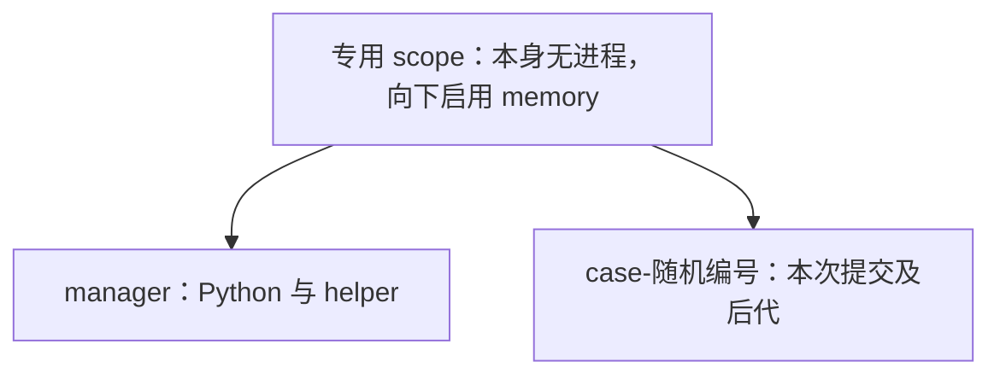

# 08 · 一次提交的内存，怎样交给内核管理

[上一章](07-signals-and-cleanup.md) · [目录](README.md) · [下一章：Python API](09-python-api.md)

循环读取进程内存会遇到一个问题：提交可能在两次读取之间申请、使用并释放一大片内存。等评测器再看时，峰值已经消失。项目让内核记录峰值，并把提交及其后代放进同一个资源组。

> 想先动手做一遍？[普通用户也能管内存](cgroup-user-memory.md) 用四层递进（手动 → 流程 → 脚本 → 监听 OOM）带你亲手跑通本章讲的机制，全程不需要 root。本章讲原理，那份文档讲怎么敲出来。

## 第一步：先分清三个内存量

你写 `vector<int> a(n)` 时，源代码表达的是申请一段可访问的空间。操作系统还涉及地址映射、实际驻留页面、共享页面以及缓存。

| 名称 | 初学时可以怎样理解 | 本项目的用途 |
|---|---|---|
| 虚拟地址空间 | 进程可使用的地址范围，未必都已占用物理内存 | 不用它直接判断 MLE |
| RSS / `ru_maxrss` | 驻留内存及其高水位统计 | `rss_kb` 辅助诊断 |
| cgroup 的内存计量 | 内核归账到资源组的内存，范围可能包括多个进程、文件缓存和部分内核内存 | `memory.peak` 用于判定 |

因此，cgroup 峰值不会严格等于数组长度，也不是把所有进程的 RSS 简单相加。共享页的归属由内核记账。项目选择的是一种明确的评分口径，不是在声称它等于 C++ 所有 `new` 的总和。

## 第二步：cgroup 是由文件接口控制的资源组

在 cgroup v2 中，一个目录表示一个组，目录里的特殊文件提供控制和统计接口。例如写入 `memory.max` 是向内核设置上限，不是在普通磁盘上保存一个配置文件。

先观察自己的环境，这些命令只读取信息：

```bash
cat /proc/self/cgroup
cat /sys/fs/cgroup/cgroup.controllers
```

第一条显示当前进程所在的组路径，第二条显示根处可见的控制器。存在 `memory` 不等于你有权限任意创建子组；项目要求调用者提供已经委派的父目录。

项目用到的核心接口如下。可以对照 [memory_cgroup.py](../../memory_cgroup.py) 找到每次读写，而不用现在记住所有文件名。

| 文件 | 项目对它做什么 |
|---|---|
| `cgroup.subtree_control` | 检查父目录已为子组启用 `memory` |
| `cgroup.procs` | 子进程写 `0`，把自己迁入该组 |
| `memory.max` | 设置本组内存保护上限 |
| `memory.swap.max` | 写 0，禁用本组 swap 用量 |
| `memory.oom.group` | 写 1，使组内 OOM 处理尽量按整体任务进行 |
| `memory.peak` | 读取组的内存峰值 |
| `memory.events` | 读取 `oom` 和 `oom_kill` 等计数 |
| `cgroup.kill` | 请求杀掉该组及其子组中的进程 |
| `cgroup.events` | 检查 `populated` 是否归零 |

接口语义和控制器规则以 [Linux 内核 cgroup v2 文档](https://docs.kernel.org/admin-guide/cgroup-v2.html) 为准。项目采用的具体读写顺序，则由本仓库代码决定。

## 第三步：观察“跑完却判 MLE”和“被 OOM 杀掉”

实验 [allocate.cpp](examples/allocate.cpp) 申请数组，实际触碰页面，然后释放并退出。配套 [cgroup_demo.py](examples/cgroup_demo.py) 分别执行 4、12、64MiB 的申请，并设置：

```text
题目内存阈值：8MiB
保护余量：16MiB
memory.max：24MiB
```

普通 Linux 桌面用户若拥有 systemd 用户会话，可在仓库根目录执行：

```bash
systemd-run --user --quiet --scope -p Delegate=yes -- \
  python3 examples/delegated.py \
  python3 docs/tutorial/examples/cgroup_demo.py
```

`systemd` 是管理服务和进程资源的系统组件。这里的 `--user` 使用当前用户的管理器，`--scope` 为这条命令建立专用的进程管理范围，`Delegate=yes` 请求把其中子组的管理交给命令自身。`examples/delegated.py` 随后在这个范围内准备目录，并通过环境变量把父目录路径交给实验。它没有替所有系统上的普通用户自动获得管理员权限。

预期观察以下关系，而不是精确的峰值数字：

| 数组申请 | 常见结果 | 为什么 |
|---|---|---|
| 4MiB | OK，正常退出 | 加上程序自身开销仍低于题目阈值 |
| 12MiB | MLE，`exit=0`、`signal=0`、无 OOM | 超过题目阈值，但未触及保护上限 |
| 64MiB | MLE，有 OOM 证据，通常被 SIGKILL | 触碰内存时达到保护上限 |

第二行最值得观察：内存判定不是“只有被杀掉才算超限”。程序释放了数组，峰值仍保留。第三行也不要用 `signal=9` 单独判 MLE；真正依据是内存事件。

如果无法连接用户 bus、没有委派权限或内核缺少所需文件，实验会报告错误。此时可继续阅读本章并运行前几章；不要把失败结果当成内存实验成功。已有委派目录时，设置 `ROJ_JUDGE_CGROUP_ROOT` 后直接运行脚本即可。脚本要求真实 cgroup，不会自动降级来伪造内存结果。

## 第四步：为什么要先准备 manager 叶子组

打开 [examples/delegated.py](../../examples/delegated.py)。它只允许操作自己独占的新 scope：检查路径结尾、写权限以及当前成员，随后把执行器迁到 `manager` 子组。



对于这里使用的普通 domain memory 控制器，向子组分配资源的非根内部节点不能同时放普通进程。脚本先把管理进程移到叶子上，再在父节点启用 `+memory`。

Python/helper 位于 manager，提交在 exec 前写入 case 组的 `cgroup.procs`。这样管理程序自己的内存不作为提交组的运行内存计量。后代通常继承创建者的组归属，所以提交 fork 出来的进程也留在 case 组里。

如果这些步骤看起来抽象，实验 [delegate_step_by_step.sh](examples/delegate_step_by_step.sh) 把它们拆成 18 个小步骤逐条演示，不依赖 `memory_cgroup.py`，只用普通 shell 命令：

```bash
bash docs/tutorial/examples/delegate_step_by_step.sh
```

它会自带委派（不必先手动启动 `systemd-run`），并依次展示三个关键事实：普通用户在会话目录里 `mkdir` 被拒绝（`Permission denied`）；委派后目录属主变成自己，但立刻开 `+memory` 仍然被拒绝（`Device or resource busy`，因为目录里还有进程）；把自己搬进 `manager` 叶子后同一命令才成功。最后它调用真正的 `runner_helper` 并读出 `memory.peak`。

## 第五步：沿着一次 MemoryCgroup 生命周期阅读

这个类实现了 Python 的 `with` 协议：进入 with 时调用 `__enter__()`，离开时调用 `__exit__()`。可以先类比 C++ 用局部对象管理资源的思路，但 Python 这里明确依靠 with，而不是等待垃圾回收。

按下面顺序读 [memory_cgroup.py](../../memory_cgroup.py)：

1. `__init__()` 只准备路径与上限，UUID 让每次执行有独立目录。
2. `__enter__()` 创建目录、写保护配置、检查所需接口；部分准备失败也要删除新目录。
3. `procs_path` 提供入组文件路径，真正的迁移动作由 helper 子进程完成。
4. `stop()` 写 `cgroup.kill`，然后等待 `populated=0`。即使后代通过 `setsid` 逃离进程组，cgroup 成员关系仍能覆盖它。
5. `memory_result()` 读取峰值和事件。字节数用于精确判定，KiB 值向上取整用于展示。
6. `__exit__()` 再确保停止并删除目录；清理超时则保留目录并报错。

`run_case()` 会在正常路径先 stop、再取峰值，离开 with 时还会 stop。这个重复是有意的：正常路径要先拿最终统计，异常路径仍必须有出口清理。每次新建组意味着事件计数从零开始，不需要猜测上次用了多少。

## 第六步：不用 Python 再做一遍同样的事

`MemoryCgroup` 看起来抽象，但它一共只做了三件普通的事，没有任何魔法：

1. **建目录、写配置**：`mkdir` 一个独立子组，往目录里的特殊文件写 `memory.max` 等；
2. **调用 helper**：把 `cgroup.procs` 路径作为参数交给 `runner_helper`，由 helper 的子进程在 `exec` 前写 `0` 入组；
3. **读统计、删目录**：读 `memory.peak` 和 `memory.events`，然后 `rmdir`。

实验 [manual_cgroup.sh](examples/manual_cgroup.sh) 用 shell 手工复刻这四个阶段（`__enter__` / `stop` / `memory_result` / `__exit__`），每节先执行等价的 shell 操作，再注释对应的 Python 源码行，最后调用真正的 `runner_helper`：

```bash
bash docs/tutorial/examples/manual_cgroup.sh
```

脚本会在需要时自己申请一个委派 scope（`systemd-run --user --scope -p Delegate=yes`），所以不必先手动启动；已有委派目录时设置 `ROJ_JUDGE_CGROUP_ROOT` 即可直接运行。用 `REQUEST_MIB` 选择场景，对应本章第三步的三种结局：

```bash
REQUEST_MIB=4  bash docs/tutorial/examples/manual_cgroup.sh   # OK
REQUEST_MIB=12 bash docs/tutorial/examples/manual_cgroup.sh   # MLE，正常退出
REQUEST_MIB=64 bash docs/tutorial/examples/manual_cgroup.sh   # MLE，被 OOM 杀掉
```

三个场景的关键输出（`REQUEST_MIB=12` 最值得对照）：

```text
REQUEST_MIB=4   peak=4718592   oom=0 oom_kill=0  signal=0  → OK
REQUEST_MIB=12  peak=13107200  oom=0 oom_kill=0  signal=0  → MLE（峰值超限）
REQUEST_MIB=64  peak=25165824  oom=1 oom_kill=2  signal=9  → MLE（OOM 事件）
```

第二行是本章的核心：程序申请 12MiB、正常退出（`exit=0`、`signal=0`、没有任何 OOM），但峰值 12800KiB 超过 8192KiB 的判定线，所以判 MLE。内存已经释放，峰值仍被内核保留。

第三行的 `peak` 停在 25165824 字节（正是 `memory.max`），说明此时峰值已经不是程序真实需求量，所以 `_set_verdict` 把“有 OOM 事件”排在“峰值超限”之前判断。

把脚本和 [memory_cgroup.py](../../memory_cgroup.py) 并排读，会看到一个值得注意的细节：**脚本里没有任何特殊的“入组”系统调用**。入组就是对 `cgroup.procs` 做一次普通的 `write`。cgroup v2 把控制面暴露成文件系统接口，所以“把程序放进资源组”和“往文件里写一个字符”在系统调用层面是同一件事。

脚本用 `trap` 保证退出时清理，这与 `__exit__` 的意图相同；但 shell 的 `trap` 只覆盖脚本自身的退出，而 Python 的 `with` 覆盖了块内任意异常。可以对比 `run_case` 为何要在 `with` 体内显式 `stop()` 一次、`__exit__` 里再 `stop()` 一次。

## 验证与思考

```bash
systemd-run --user --quiet --scope -p Delegate=yes -- \
  python3 examples/delegated.py python3 -m unittest -v \
  test_runner.RunnerTests.test_peak_survives_free_and_immediate_exit \
  test_runner.RunnerTests.test_cleanup_includes_detached_descendants
```

关闭 cgroup 后，为什么不能简单把 `rss_kb` 填到 `memory_kb` 里继续评分？

<details>
<summary>参考答案</summary>

两者的统计对象和组成不同。换字段等于悄悄更换评分规则，还失去了整组内存限制和事件证据。因此降级模式明确不判 MLE；它报告的内存峰值 0 表示未测量，不是实际使用为零。

</details>
