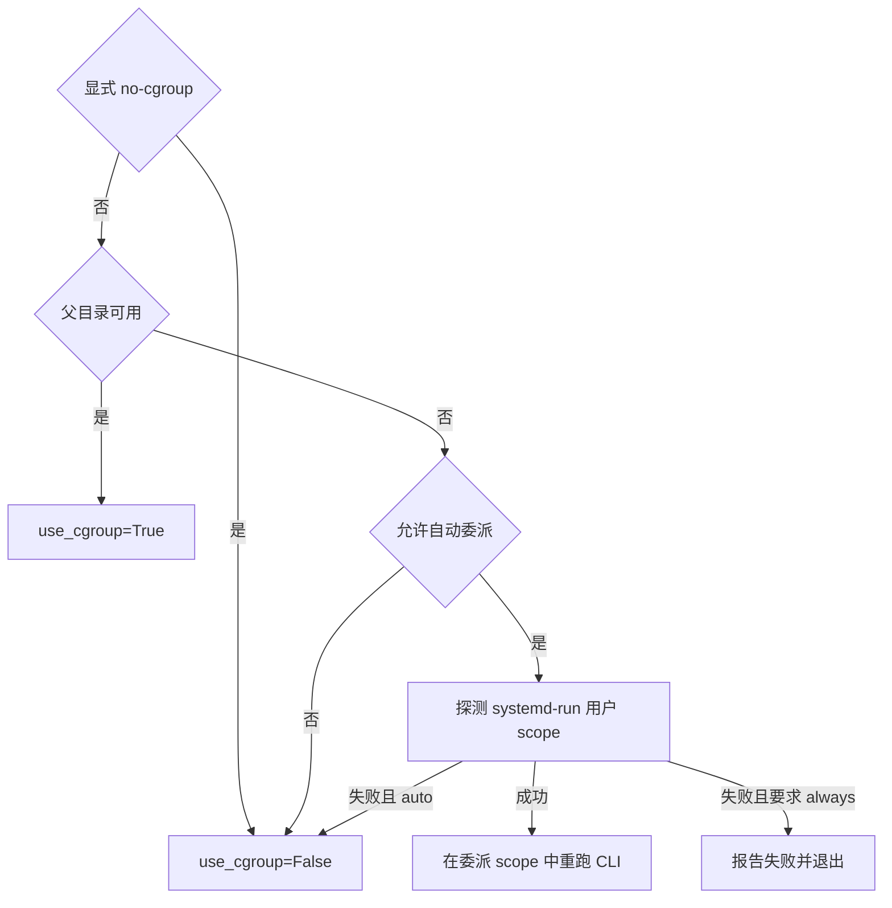

# 10 · 回到源文件，把完整评测串起来

[上一章](09-python-api.md) · [目录](README.md) · [附录：运行环境与测试](appendix-environment-and-tests.md)

现在 `run_case()` 已经不再是黑盒。最后读 [local_judge.py](../../local_judge.py)：它把测试数据、编译、执行 API 和答案比较串成一个面向使用者的命令。

## 第一步：带着源码重新评测 A+B

```bash
python3 local_judge.py --pid 1000 docs/tutorial/examples/sum.cpp \
  --testdata testData --checker none --no-cgroup --keep-work-dir
```

应再次得到 10/10 AC，并在最后显示 `工作目录：...`。这次先不要关闭终端：打开那个目录，观察编译产物 `solution`、每个测试点的 `.out` 和 `.err`。`--keep-work-dir` 是 CLI 的保留开关，cgroup 仍有自己的生命周期，不随这个开关保留。

## 第二步：从 main 进入参数与题目数据

`build_parser()` 用 `argparse` 声明命令行参数，`parse_args()` 把它们装进 `args`。参数名中的连字符变成属性下划线，例如 `--keep-work-dir` 对应 `args.keep_work_dir`。`type=Path` 或 `type=int` 让解析器先做类型转换。

先跟进 `resolve_testdata()`：当前代码按以下顺序尝试候选目录，并返回第一个存在的目录：

1. 显式的 `--testdata`。
2. 当前目录的 `testData`。
3. 当前目录上一级的 `testData`。
4. 包内自带的 `testData`。
5. 包的上一级 `testData`，兼容旧布局。

注意这是当前实现的“候选目录查找”：如果显式路径不存在，它仍会继续尝试后面的目录。教程实验使用确实存在的 `--testdata testData`，让数据来源确定。

`Path / 字符串` 在 Python 里表示路径拼接，不是数值除法。找不到任何目录会得到 None，`main()` 先报告所有尝试路径，再返回 2，避免对 None 拼接题号。

`load_cases()` 配对 `.in` 和同名 `.out`，`_natural_key()` 让 `problem2` 排在 `problem10` 前。读列表推导式时，可以先把它展开成普通 for 循环理解；这里并没有隐藏的评测逻辑。

`load_problem_meta()` 读取题目配置，缺失或不合法时采用默认值；`--time`、`--memory` 再覆盖读取到的数值。当前两道示例题的配置都是 1000ms、128MiB。

## 第三步：编译只做一次

`compile_submission()` 对 C++ 调用：

```text
g++ -std=c++17 -O2 -DONLINE_JUDGE -o 临时目录/solution 源文件
```

`-DONLINE_JUDGE` 定义预处理宏，便于兼容常见的竞赛提交。编译器也是一个外部进程，所以通过 `subprocess.run()` 启动，捕获输出，并设置 120 秒编译超时。编译失败返回 `(None, 错误消息)`，CLI 报 CE；成功返回 `(运行命令列表, 空消息)`。

Python 使用 `py_compile` 检查语法，再返回解释器运行命令。语法通过不保证运行成功，例如运行时除零仍然是 RE。编译或语法检查阶段没有套入每个测试点的 cgroup 与题目时限；不能把提交运行限制理解成整个工具的全局限制。

Python 多返回值其实是元组：`run_argv, compile_output = ...` 是解包。与 C++ 返回一个结构体再取两个字段的作用相近。

## 第四步：读懂自动委派与降级的决策

这一段在 `main()` 里发生于编译前：



这里的“允许”还取决于是否显式提供 `--cgroup-root`。提供了就尊重该目录，不自动换成另一个 scope。`--no-delegate` 阻止已经重启到 scope 内的 CLI 再次递归委派。

`try_auto_delegate()` 做可用性探测，`run_delegated()` 负责启动完整命令。主进程把结果展示交给重启后的 CLI，并转发其退出码。

无论怎样选中模式，测试点循环都只有一次 `run_case(..., use_cgroup=isolated)`。这就是前面学到的能力选择与执行机制分离。

## 第五步：只对 OK 的运行比较答案

测试点循环可以概括为下面这段原有结构：

```python
result = run_case(...)
verdict = result.verdict.value
if verdict == 'OK':
    verdict = 'AC' if compare_output(...) else 'WA'
elif verdict == 'SYSTEM_ERROR':
    verdict = 'SE'
```

以上省略号表示省略参数，不是独立可运行的程序。回到文件时，要把对应的 `run_argv`、输入、输出、限制和标准答案填回脑中的流程。

为什么 TLE 后不继续判断 WA？因为提交可能只输出了一半，资源错误已经足以确定该测试点未通过。只有运行正常，才有意义评估答案是否正确。

## 第六步：精确理解内置比较规则

`compare_output()` 在未使用外部 checker 时调用 `normalize_lines()`。运行这个小实验：

```bash
python3 - <<'PY'
from local_judge import normalize_lines

print(normalize_lines('5  \n\n') == normalize_lines('5\n'))
print(normalize_lines(' 5\n') == normalize_lines('5\n'))
print(normalize_lines('1  2\n') == normalize_lines('1 2\n'))
PY
```

预期依次是 `True`、`False`、`False`。它删除行尾空白和末尾空行，但保留行首空白、行内多个空格以及中间空行。这不是通用的“按空白切 token 比较”。

如果指定外部 checker，则按“输入文件、用户输出、标准输出”的顺序传参，并把退出码 0 当作通过。WA 的 `first_difference()` 只是展示线索；特殊 checker 的判断不一定能用逐行差异完整解释。

## 第七步：汇总与清理

`verdicts` 保存各测试点结果。`passed = verdicts.count('AC')` 统计通过数，`next((v for v in verdicts if v != 'AC'), 'AC')` 找到第一个非 AC；括号中的表达式逐个生成候选值，最后的 `'AC'` 是没有候选时的默认值。

外层 `finally` 在正常返回或异常离开时处理工作目录。`--keep-work-dir` 为真就保留，否则 `shutil.rmtree()` 删除本次临时目录。它与 `run_case()` 的进程/cgroup 清理各管一类资源。

阅读结果时还要区分三种退出码：用户程序退出码、helper 退出码、CLI 给 shell 的退出码。当前 `local_judge.py` 全 AC 返回 0，正常完成但存在非 AC（包括测试点 SE）返回 1，许多前置错误或 CE 返回 2，Ctrl+C 返回 130。不要把测试点 SE 自动等同于 CLI 必然返回 2。

## 最后一次全链路追踪

现在回到刚才保留的工作目录，挑一个 `case-1.out`，从头解释它的来历：

```text
main 选测试点
  → run_case 准备绝对路径、可选 cgroup
  → Popen 启动 helper
  → helper fork 子进程
  → 子进程重定向、限额、降权、exec 提交
  → 提交把答案写到 case-1.out
  → helper wait4，写资源 JSON
  → Python 清理、补内存统计、判定 OK
  → CLI 比较标准答案，得到 AC
```

在源码中为每个箭头找到一个具体调用。做到这一步，就已经从“知道几个系统调用”走到了“能读懂它们怎样共同工作”。

## 验证与思考

```bash
python3 -m unittest -v test_runner.LocalJudgeTests
```

这些测试覆盖 AC、WA、RE、CE、TLE，以及缺失数据与自动降级。请再去测试源码中找出：它们如何构造临时题目，如何保证不依赖开发者机器上的题库？

<details>
<summary>参考答案</summary>

测试在临时目录里创建输入、标准输出与提交文件，并显式传 `--testdata`；缺失数据测试固定查找结果，再检查退出码和提示。临时目录退出后自动清理，所以同一测试可以重复运行。

</details>
